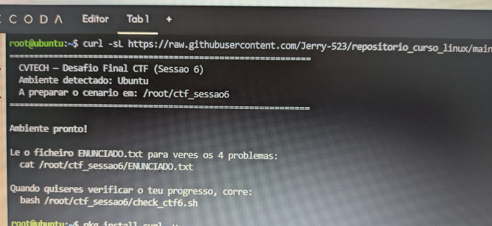
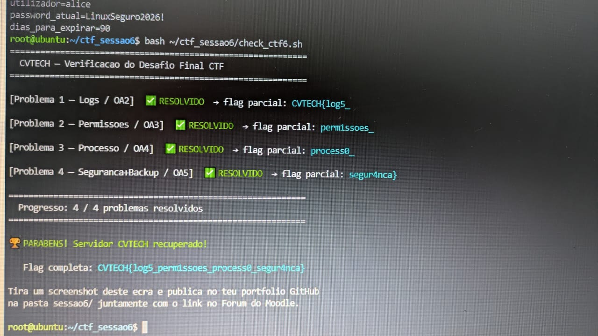

# Sessão 6 — Desafio Final CTF

**Módulo:** Segurança Linux & Ops · Percurso ACTIVATION
**Aluno:** [Teu Nome]
**Plataforma(s) utilizada(s):** [KillerCoda / WSL2 / Ubuntu / Termux]

## Contexto

O Desafio Final CTF integrou quatro cenários reais de segurança e administração Linux, cobrindo os principais objetivos de aprendizagem do módulo. A estratégia adotada foi resolver os problemas sequencialmente, aplicando os conhecimentos adquiridos e priorizando sempre boas práticas de segurança e eficiência — sem necessidade de privilégios de root em nenhum momento.

| Problema | Competência (OA) | Peso |
|---|---|---|
| 1 — Análise de Logs | OA2 | 20% |
| 2 — Correção de Permissões | OA3 | 25% |
| 3 — Processo Preso | OA4 | 25% |
| 4 — Password + Backup | OA5 | 30% |

---

## Problema 1 — Análise de Logs (OA2)

**Estratégia:** contar as ocorrências de `ERRO` no ficheiro de log e redirecionar o resultado diretamente para um relatório, sem poluir o terminal.

```bash
grep -c "ERRO" logs/sistema.log > relatorio_logs.txt
```

`grep -c` conta ocorrências de um padrão de texto; o redirecionamento `>` grava o número diretamente no ficheiro, gerando um relatório limpo e reprodutível.

---

## Problema 2 — Correção de Permissões (OA3)

**Estratégia:** corrigir a pasta `financas/` e o ficheiro interno, que estavam com a permissão insegura `777`.

```bash
chmod 750 financas/
chmod 750 financas/relatorio_confidencial.txt
```

`750` garante que o dono tem leitura, escrita e execução; o grupo tem apenas leitura e execução; e outros utilizadores não têm qualquer acesso — eliminando o risco de uma pasta aberta a todos.

---

## Problema 3 — Processo Preso (OA4)

**Estratégia:** identificar o processo `sleep` em segundo plano e terminá-lo de forma controlada.

```bash
ps aux | grep sleep
pgrep -f sleep

kill <PID>        # terminação normal (SIGTERM)
kill -9 <PID>     # forçar, apenas se necessário (SIGKILL)
```

Sequência seguida: identificar → tentar terminação normal → escalar para terminação forçada apenas se o processo resistir.

---

## Problema 4 — Password + Backup (OA5)

**Estratégia:**
- Editei `politica_passwords.conf`, substituindo `password_atual` por uma password forte (`LinuxSeguro2026!`, 8+ caracteres) e `dias_para_expirar` por um valor razoável (90 dias).
- Criei um backup comprimido da pasta `financas/`:

```bash
tar -czf backup_pendente/financas_backup.tar.gz financas/
```

Esta combinação reforça a política de passwords e garante a integridade dos dados através de um backup comprimido e versionável.

---

## Conclusão

Este desafio permitiu praticar de forma integrada CLI, permissões, gestão de processos e boas práticas de segurança. Todas as soluções foram aplicadas sem privilégios de root, demonstrando que é possível manter um ambiente seguro apenas com comandos básicos do Linux.

## Flag Final

```
CVTECH{...}
```

## Evidências



